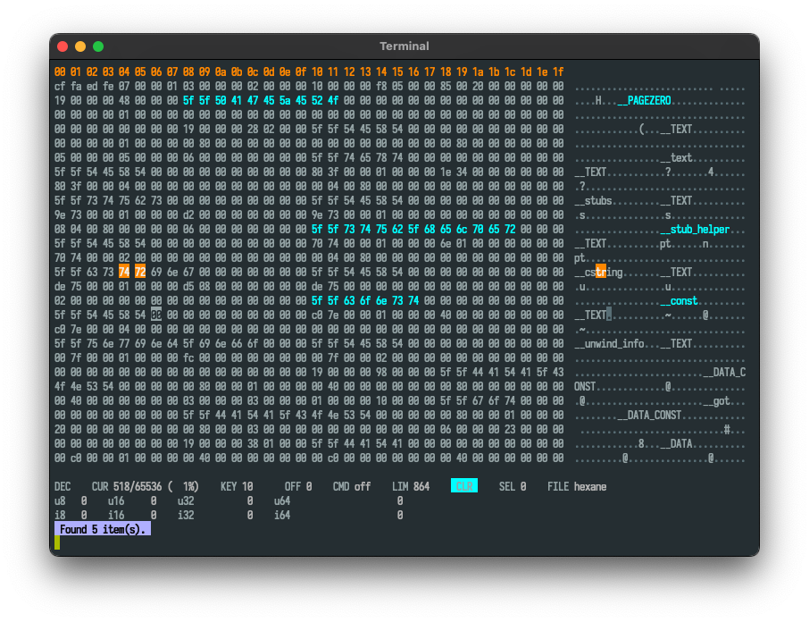

# Hexane

This is a terminal HEX editor. It'll be fancy (and I have it already written
in Python with all the fancy stuff and now I'm rewriting it to C).

## Why?

I tried to find a hex editor which would at least display a cursor in the
ASCII representation view but apparently it's too much to ask so I wrote my own.

This editor might have some bugs and eat up resources when handling large files,
I don't really know if that's the case. But it's pretty good with sensibly-sized
portion of data which you're trying to get a grasp of or for a quick edit.

## Features

### Implemented features

* Vi-like keybindings
* Selection
  * Some operation on selections like increment, decrement and replace
* Color-marking the bytes
  * Color picker
* Search
  * Handling multiple search queries at once
  * Handling queries in different number bases (decimal, hex, octal)
  * Navigating through search results
* Comments
* HEX/DEC modes
* ASCII View
* Lines/Columns number settings
  * Also an autosize mode

### TODO

* Rectangle selection mode
* Buffer manipulation
  * Removing bytes
  * Inserting bytes
  * Copy/paste
  * Editing bytes
  * Big-endian view
* History
* Serialization of metadata to save comments and color markings
* Config file

## Usage

#### Cursor

The cursor movement is similar to Vi. `h`, `j`, `k`, `l`, `w`, `b`, `[`, `]`,
`g`, `G`, `0`, `$` let you move around.

#### Search

To search for bytes, just type `/` (or `:/ `).
Search queries are separated by `,`.
A single query can be multiple bytes (separated by spaces). For example, if you
want to search for sequece `5f 5f` and for sequence `de ad be ef`, you type:

```
:/ 0x5f 0x5f, 0xde 0xad 0xbe 0xef
```

#### Selection

You can select bytes with `v` and cursor movement. To apply current selection,
type `v` again.

If you want to replace selected bytes with a value, type:

```
:r 0x66
```

To navigate through the search results, use `n` and `N`.

#### Color marking

Press `F2` to choose a color, press `m` to mark selected bytes or a byte at
current position if there's no selection at the moment.

#### Comments

To set a comment under current byte, type

```
:com Your comment
```

To delete it

```
:comdel
```

#### Number format

You can also provide decimal numbers in commands like `128` and octal `010`.

## File formats

The editor is of course able to store raw bytes but it'll also have another
format which will include marked and commented bytes which will be useful
for reverse-engineering data.

## Screenshots

The Python version looks like this:


and the C version currently looks like this:




## Dependencies

Aside standard POSIX library, none at the moment.

## Building

Clone the repository, `cd` into it and type

```bash
$ make
```

I hope it works for you.
